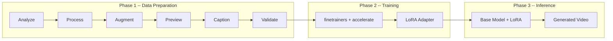
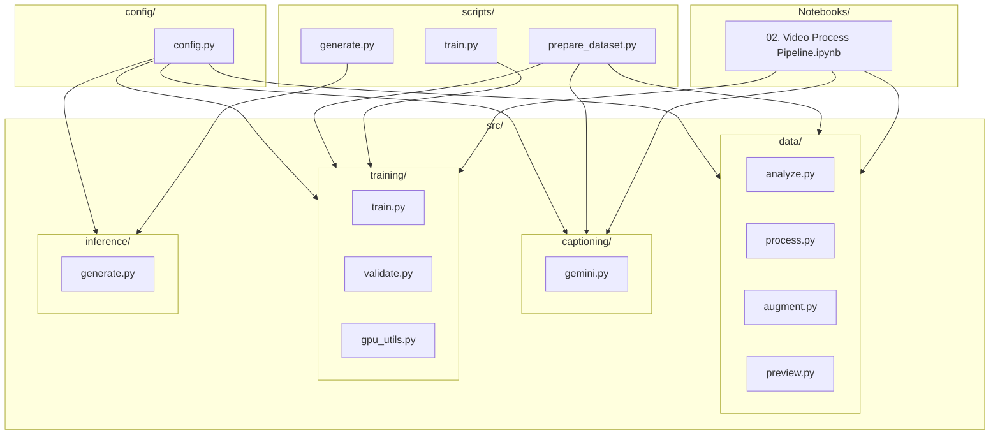

# HunyuanVideo LoRA Fine-Tuning Pipeline

End-to-end pipeline for fine-tuning [HunyuanVideo](https://huggingface.co/hunyuanvideo-community/HunyuanVideo) with LoRA to generate personalized videos from text prompts. Uses a trigger-token approach (similar to DreamBooth) where a unique token (`ohwx`) is bound to a specific subject during training, then used at inference time to place that subject into novel scenes.

## Architecture

### Pipeline Phases



**Phase 1** transforms raw phone/camera footage into a training-ready dataset: normalized resolution, frame rate, duration, augmented variants, and text captions.

**Phase 2** fine-tunes the HunyuanVideo transformer with LoRA using the [finetrainers](https://github.com/huggingface/finetrainers) library, producing a lightweight adapter (~100 MB) instead of modifying the full 13B-parameter model.

**Phase 3** loads the base HunyuanVideo model, applies the LoRA adapter, and generates new videos from text prompts containing the trigger token.

### Module Architecture



## Project Structure

```
Video_Generation_Model/
├── config/
│   ├── config.py              # All project settings (paths, hyperparams, API keys via .env)
│   └── config.py.example      # Sample config -- copy to config.py to get started
├── src/
│   ├── data/
│   │   ├── analyze.py         # Video metadata extraction (resolution, fps, brightness)
│   │   ├── process.py         # Resize, crop, re-encode, trim via FFmpeg
│   │   ├── augment.py         # Data augmentation (sub-clipping, flip, speed, color jitter)
│   │   └── preview.py         # Thumbnail grid visualization
│   ├── captioning/
│   │   └── gemini.py          # Auto-captioning with Gemini 2.5 Flash
│   ├── training/
│   │   ├── train.py           # finetrainers setup, training script generation, launch
│   │   ├── validate.py        # Dataset integrity checks before training
│   │   └── gpu_utils.py       # CUDA capability detection (bf16, fp8, compute capability)
│   └── inference/
│       └── generate.py        # Load HunyuanVideo + LoRA, generate video from prompt
├── scripts/
│   ├── prepare_dataset.py     # CLI: full data preparation pipeline
│   ├── train.py               # CLI: launch LoRA training
│   └── generate.py            # CLI: generate video with trained adapter
├── Notebooks/
│   ├── 01. Test.ipynb         # Quick model loading / generation test
│   └── 02. Video Process Pipeline.ipynb  # Interactive data preparation walkthrough
├── data/
│   ├── raw/                   # Input: raw video files (not committed)
│   └── processed/             # Output: processed videos, captions.json, videos.txt, prompts.txt
├── output/
│   └── lora_weights/          # Trained LoRA checkpoints (not committed)
├── tests/                     # pytest suite mirroring src/ structure
├── requirements.txt
├── pyproject.toml
├── .env.example               # Template for required API keys
└── .gitignore
```

## Prerequisites

| Requirement | Details |
|---|---|
| Python | >= 3.10 |
| FFmpeg | Must be on `$PATH` (used for all video processing) |
| GPU | NVIDIA CUDA GPU (see VRAM tiers below) |
| Gemini API Key | For auto-captioning ([aistudio.google.com](https://aistudio.google.com)) |
| HuggingFace Token | For downloading the gated HunyuanVideo model |

### GPU VRAM Tiers

| VRAM | FP8 | Resolution Buckets | Max Frames | Notes |
|---|---|---|---|---|
| 80 GB+ | Off | 17x512x768, 49x512x768 | 49 | Full precision |
| 40 GB | Auto (sm_89+) | 17x512x768, 49x512x768 | 49 | FP8 upcasting on Ada/Hopper GPUs |
| 24 GB | Auto (sm_89+) | 17x512x768 | 17 | FP8 + reduced frame count |

FP8 requires compute capability >= 8.9 (RTX 4090, L40, H100). On older GPUs FP8 is disabled automatically.

## Setup

```bash
git clone <repo-url> && cd Video_Generation_Model

python -m venv .venv && source .venv/bin/activate

pip install -r requirements.txt

# Secrets -- copy templates and fill in your keys
cp .env.example .env
cp config/config.py.example config/config.py
# Edit .env and set GEMINI_API_KEY and HF_TOKEN
```

Secrets (`GEMINI_API_KEY`, `HF_TOKEN`) are loaded from the `.env` file via `python-dotenv`. Neither `.env` nor `config/config.py` are committed to the repo -- only the `.example` templates are tracked.

Place raw video files (`.mp4`, `.mov`, `.avi`) into `data/raw/`.

## Usage

### Option 1: Notebooks (recommended for exploration)

Open `Notebooks/02. Video Process Pipeline.ipynb` and run cells sequentially. Each pipeline step is a separate section with inline previews and summary statistics.

### Option 2: CLI Scripts

```bash
# Step 1: Prepare dataset (analyze, process, augment, caption, validate)
python -m scripts.prepare_dataset

# Step 2: Train LoRA adapter
python -m scripts.train

# Step 3: Generate video
python -m scripts.generate --prompt "ohwx running through a park, cinematic lighting"
```

Script flags:

```bash
python -m scripts.prepare_dataset --skip-caption    # Reuse existing captions
python -m scripts.prepare_dataset --skip-preview     # Headless / no display

python -m scripts.train --steps 2000 --rank 128 --lr 1e-4 --batch-size 1

python -m scripts.generate --lora-strength 0.8 --steps 50 --seed 123
```

### Option 3: Python API

```python
from src.data.analyze import analyze_all
from src.data.process import process_all
from src.captioning.gemini import caption_all
from src.training.validate import validate_dataset
from src.inference.generate import load_pipeline, generate_video
```

## Pipeline Details

### 1. Analyze (`src/data/analyze.py`)

Scans every video in `data/raw/` and extracts metadata with OpenCV: resolution, frame rate, frame count, duration, mean brightness, and flags for black or overexposed frames. Videos shorter than `MIN_DURATION_SEC` are flagged.

### 2. Process (`src/data/process.py`)

Normalizes each video to training specs via FFmpeg:

- **Resize** to 768x512 (scale up to cover, then center-crop to exact dimensions)
- **Re-encode** at 24 fps, H.264, CRF 18, `yuv420p`
- **Trim** to the first 5 seconds (`MAX_DURATION_SEC`)
- **Strip audio** (`-an`)

Each output is validated against target specs before being accepted.

### 3. Augment (`src/data/augment.py`)

Expands the dataset from processed clips using FFmpeg-based augmentations that are temporally consistent across all frames:

| Augmentation | Method | Multiplier |
|---|---|---|
| Temporal sub-clipping | Sliding window with configurable stride | ~3-6x per long video |
| Horizontal flip | `hflip` filter | 2x |
| Speed perturbation | `setpts` filter (0.85x, 1.15x) | +2 variants |
| Brightness / contrast | `eq` filter (subtle +/- shifts) | +2 variants |
| Saturation jitter | `eq=saturation` filter (+/- 15%) | +2 variants |
| Multi-position crop | Parameterized crop offsets | +2 variants |

### 4. Preview (`src/data/preview.py`)

Extracts 4 evenly-spaced thumbnail frames per video and displays a matplotlib grid for visual QA.

### 5. Caption (`src/captioning/gemini.py`)

Extracts the mid-frame from each video, sends it to Gemini 2.5 Flash with a structured prompt that enforces the trigger token (`ohwx`) as subject identifier. Outputs:

- `captions.json` -- filename-to-caption mapping
- `videos.txt` -- one video path per line
- `prompts.txt` -- one caption per line (same order)

### 6. Validate (`src/training/validate.py`)

Pre-training integrity checks: resolution matches target, frame count >= 17, captions are non-empty and non-failed, video files are non-trivially sized, and `videos.txt` / `prompts.txt` line counts match.

### 7. Train (`src/training/train.py`)

Clones [finetrainers](https://github.com/huggingface/finetrainers) v0.0.1, generates a training shell script, and launches it via `accelerate`. Key settings:

- LoRA on transformer attention layers (`to_q`, `to_k`, `to_v`, `to_out.0`)
- Rank 64, alpha 64
- AdamW optimizer, LR 2e-4 with cosine warmup
- bf16 mixed precision, gradient checkpointing
- 1500 steps, batch size 1, gradient accumulation 4
- 5% caption dropout for classifier-free guidance

### 8. Inference (`src/inference/generate.py`)

Loads the base HunyuanVideo model, applies the trained LoRA adapter at a configurable strength (default 0.6), enables VAE tiling and model CPU offload for memory efficiency, then generates video from a text prompt.

## Configuration

All settings live in `config/config.py` and read secrets from `.env` via `python-dotenv`.

| Parameter | Default | Description |
|---|---|---|
| `TARGET_WIDTH` | 768 | Output video width |
| `TARGET_HEIGHT` | 512 | Output video height |
| `TARGET_FPS` | 24 | Output frame rate |
| `MAX_DURATION_SEC` | 5 | Max clip length |
| `MIN_FRAMES` | 17 | Minimum frame count for a valid clip |
| `TRIGGER_TOKEN` | `ohwx` | Subject identifier token |
| `TRAIN_STEPS` | 1500 | Training iterations |
| `LORA_RANK` | 64 | LoRA rank |
| `LEARNING_RATE` | 2e-4 | Optimizer learning rate |
| `CAPTION_DROPOUT` | 0.05 | Probability of dropping caption during training |
| `LORA_STRENGTH` | 0.6 | Adapter weight at inference |

## Testing

Tests mirror the `src/` module structure under `tests/` and run with pytest:

```bash
pytest
```

Configuration in `pyproject.toml`:

```toml
[tool.pytest.ini_options]
pythonpath = ["."]
testpaths = ["tests"]
```
